# COMP2300-STM32L476-MCU
(COMP 2300 Sequencer Assignment)

## Overview

In this assignemnt, I attempted:
- Sequencer that can play multiple notes simultaneously
- Sequencer that plays songs that are stored in ASCII format
You can uncomment any one of the functions starting with DEMO in the main function to run the demonstrations for the above functionality, a list of available DEMO function will be attached in the appendix: Demo Function. Explanation for content for each file are also attached, please see: Files walk through.

## Things being made

I created a function play_pitchArrayNotes that is capable of playing a song, whose each beats is the harmonic of multiple note. It plays via a data structure called PitchesArray, which is made of a list of another data structure NOTEs_DUR data. (more detail in next part)
For the ASCII part, I didn’t manage to implement a good enough sequencer that is capable of reading from formally stored ASCII score. But just for a light taste of this topic, I made this function readNoteArray that is capable of playing my own ASCII score, whose each note/beat is stored as 4 character, for example "A#bc".


## Implmentation details 

**Playing Multiple Notes Simultaneously:**

My implementation of wave generating function in part-1 (play_sound) uses data in memory to do operations. In each of its iteration: it takes the existing wave’s "y-position" and "delta-y" in memory (both are initialed once in the first run), change the "y-position", then "y-position" back in the memory. (Also play the "y-position" via BSP_AUDIO_OUT_Play_Sample )
I inherited ideas form part-1, and did some minor changes to it (the result if function get_wave_pos), such that: it takes extra input parameter, the base address of a wave_data data structure’s base address. (See: Wave Data) Then it will run the same operations but using the offset from the wave_data ’s base address to find wave’s "y-position" and "delta- y" in the memory, and instead of running BSP_AUDIO_OUT_Play_Sample at the end, it returns the "y-position" as a return value. And when it comes to generating the "y-position" for different wave (of different frequency), all required is to give different wave_data’s base address, and this modified function get_wave_pos will calculate each wave’s the "y- position" independently.
And with the knowledge from synth assignment, when notes are played at the same time, their wave combines, also considering that BSP_AUDIO_OUT_Play_Sample has a limit in dynamic range, the final step before playing sound is to add those obtained "y-position", and average them, the averaged "y-position" is then played via
1
BSP_AUDIO_OUT_Play_Sample. (For the result of please see: 5 Harmonic Notes - Wave and 10 Harmonic Notes - Wave)
To assists the above function, such that it can play a sequence of such beats made of harmonic of notes. I also made a data structure notes_data (Appendix: NOTEs_Data), to store the notes that need to be played simultaneously. And a data structure pitches_array (Appendix: PitchesArray_DATA) containing such notes_data , alone with the duration a beat lasts for. Then in the play_pitchArrayNotes, each element in the
pitches_array is processed: each notes notes_data goes in get_wave_pos to get the "y- position" individually, and averaged to get the harmonic’s "y-position", then played for the specified duration. (Function play_xxS_for_yy called for each iteration)

**Reading From ASCII String**

Playing notes from ASCII strings is alike playing from a note array. Function needs to iteration through each "note element" in the string , and play the note/beat using the information in it.
The function I implemented is readNoteArray, it has very specific requirement in such note "element", each such "element" is a sub-string made of 4 character tuple, every character has its unique use.
1st, 2nd, 4th Character: note’s letter notation (A-G), sharp notation (#/_), High/Center/ Low Octave. Using the feature of uniform distancing from A-Z in ASCII text, an offset indicating the distance between the desired note to the Center-A is calculated (Please See: ASCII Note Offset). Then using a table that records the frequency of notes in order, and basic ldr instruction with this calculated offset, the frequency of the note can be retrieved. (Please See: Pitch Table)
3rd Character: the duration (can be: a/b/c/d/e). The duration is represented in this character as "a"-"g",each represents a unique timing, say "a" represents a 1/8 second beat. (Please See ASCII Duration)
Such ASCII string of tune’s score needs to be stored in an ascii_array (an example of such string is in the appendix: ASCII Array: Astronomia) Function readNoteArray will then iterate through each of the note sub-string, extract the relevant information through each 4-character tuple, then use play_xx_for_yy to play the note (note of xx frequency and yy duration). (Also note that if ~ appears in the tuple, it is considered a delay)

## Example ASCII Music Score

**打ち上げ花火**

```
2.1 3.1 5.1 1.1 2.1 3.1 5.1 1.1 2.1 3.1 5.1 6.1 2.1 3.1 6/1 1.1

2/1 3/1 5/1 2/1 3/1 5/1 1/1 2/1 3/1 5/1 2/1 3/1 5/1 1/1 
2/1 3/1 5/1 2/1 3/1 5/1 1/1 2/1 3/1 5/1 2/1 3/1 5/1 1/1 

6/2 1.1 2.2 7/1 5/1 4/1 3/1 5/1 1.2 1.2 1.1 7/1 
6/2 1.2 7/1 5/1 5/2 5/2 5/2 5/2 5/2 3/1 5/1

6/2 1.1 2.2 7/1 5/1 4/1 3/1 5/1 1.2 1.2 1.1 7/1 
6/2 1.2 7/1 6/1 5/1 6/1 6/2 6/2 6/2 6/1 7/1

1.2 1.1 7/1 6/1 7/1 1.2 1.1 7/1 6/1 7/1 1.1 7/1 5/1  6/1 
5/1 1/1 1/1 6/1 5/1 1/1 2/1 3/1 3/2 3/2 3/2 6/1 7/1 

1.2 1.2 7/1 6/1 7/1 1.2 1.1 7/1 6/1 7/1 1.1 2.1 3.1 4.1 
4.1 1.1 1.1 3. 2.1 1.1 1.2 1.2 1.2 1.2 3.1 5.1 3.1 

2.1 1.1 6/1 1.1 2.2 3.1 5.1 3.1 2.1 1.1 6/1 1.2 1.2 3.1 5.1 3.1 
2.2 3.1 5.2 5.1 6.1 5.1 4.1 3.1 3.2 3.2 3.2 3.1 5.1 3.1 

2.1 1.1 6/1 1.1 2.2 3.1 5.1 3.1 2.1 1.1 6/1 1.2 1.2 7/1 6/1 7/1 
6/2 2.2 7/1 6/1 7/1 7/1 7/1 1.1 1.2 1.2 1.2
```


Astronomia

```
4 4 4 4 6 6 6 6 5 5 5 5 1.1.1.1.2.2.2.2.2.2.2.2.5 4 3 1 2 0 2 6 
5 0 4 0 3 0 3 3 5 0 4 3 2 2 4.3.4.3.4.2  2 4.3.4.3.4.2 0 2 6 
5 0 4 0 3 0 3 3 5 0 4 3 2 2 4. .3.4.3.4.2  2 4.3.4.3.4.4 4 4 4 
6 6 6 6 5 5 5 5 1.1.1.1.2.2.2.2.2.2.2.2.5 4 3 1 2 0 2 6 5 0 4 0 
3 0 3 3 5 0 4 3 2 0 2 4.3.4.3.4.2 0 2 4.3.4.3.4.2 0 2 6 5 0 4 
3 0 3 3 5 0 4 3 2 0 2 4.3.4.3.4.2 0 2 4.3.4.3.4.

```


## Appendix

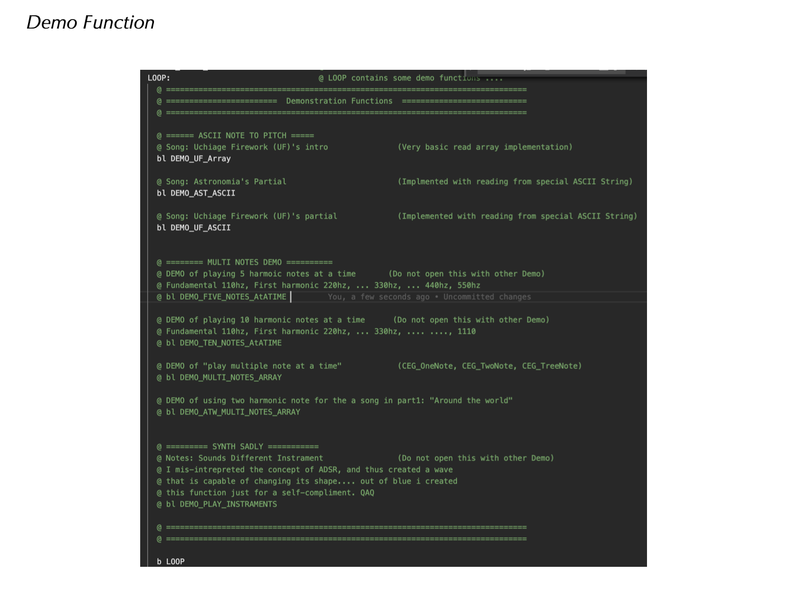

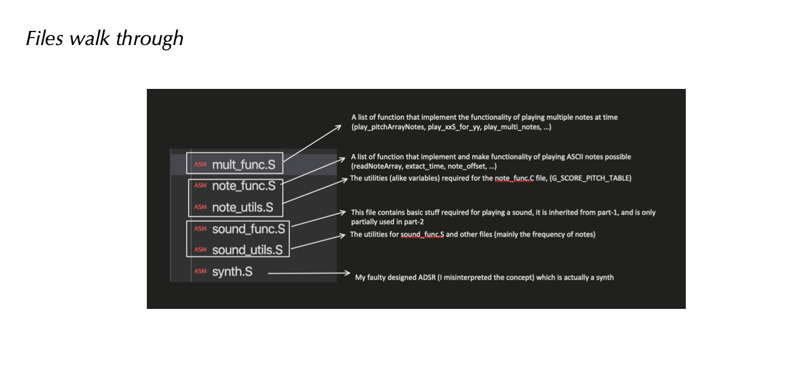

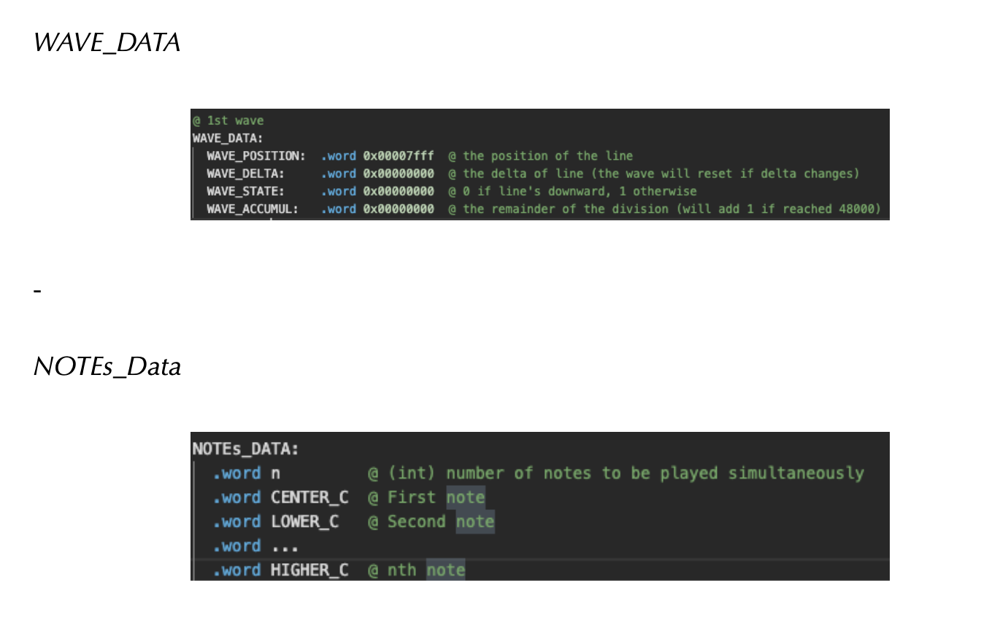

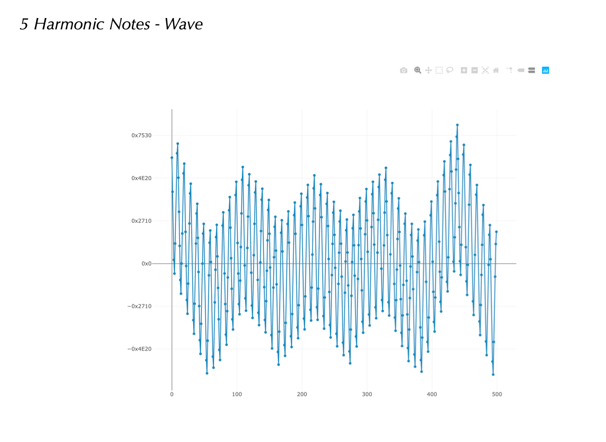

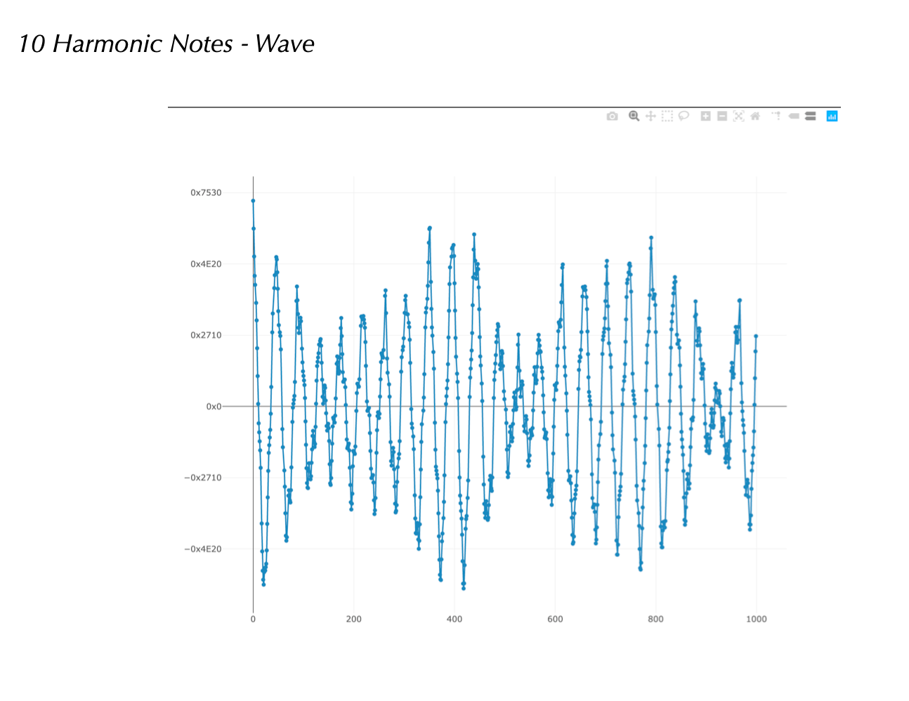

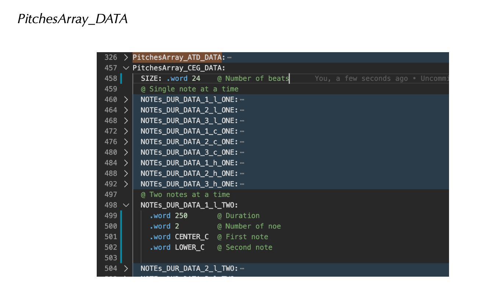

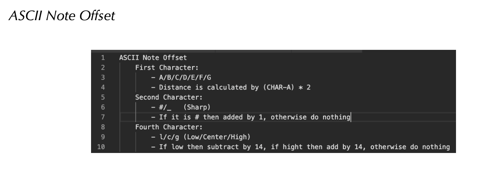

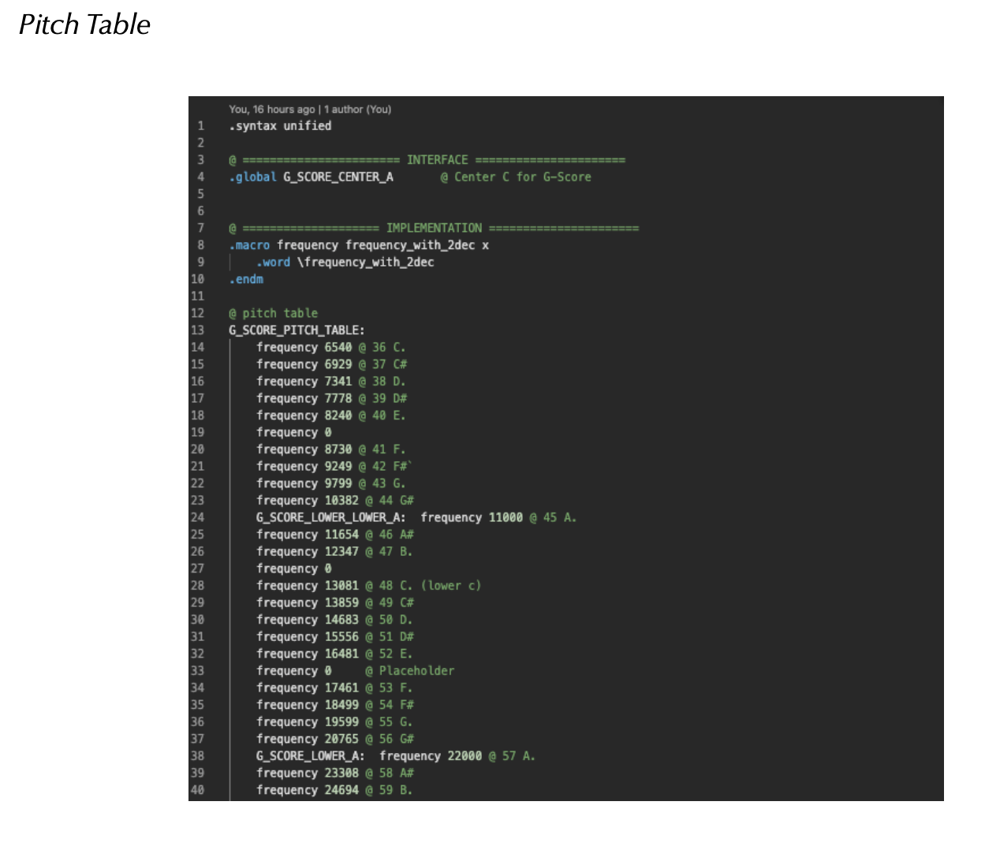

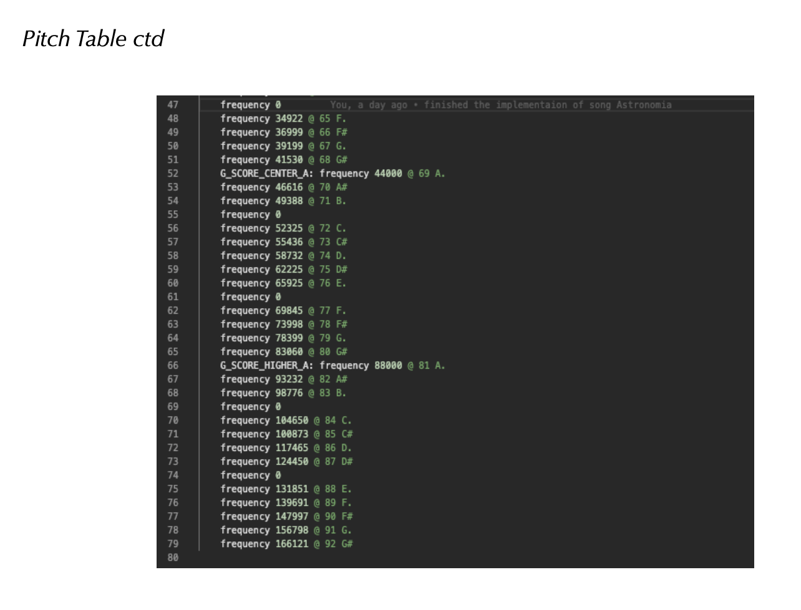

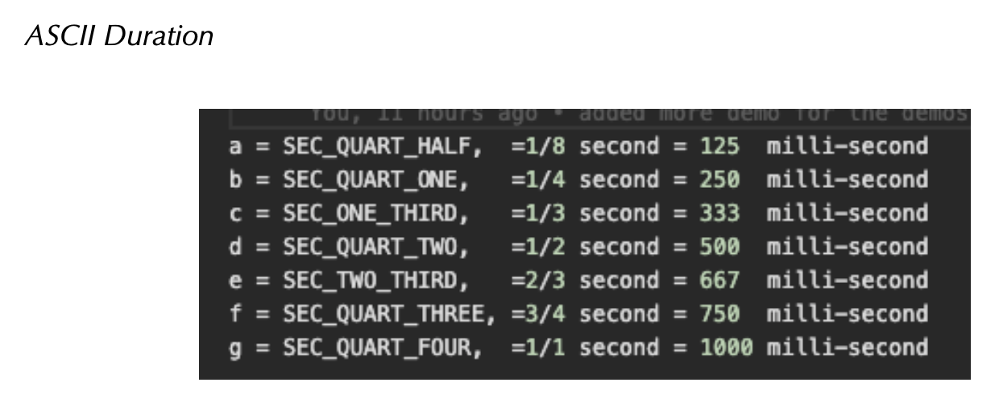

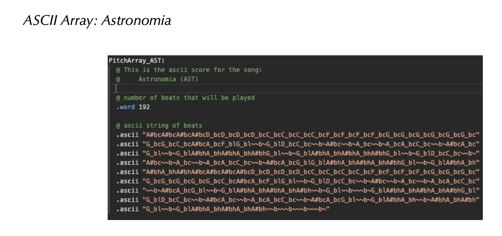


